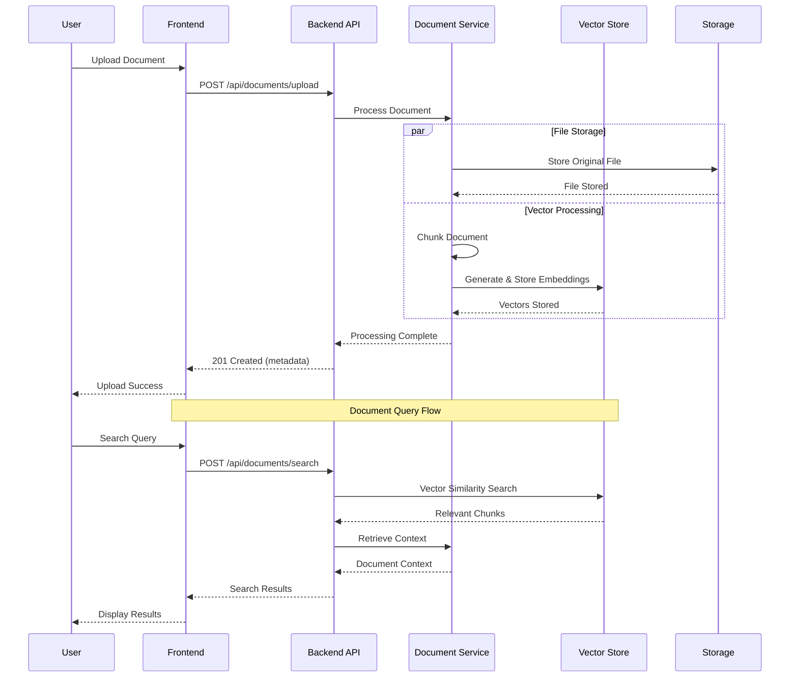

# Insurance Chatbot

## Executive Summary

Insurance Chatbot is a modern document-management system designed specifically for insurance policy documents. It combines a FastAPI backend for document processing and vector storage with a Next.js frontend for a seamless user experience. The system uses advanced NLP techniques to process, index, and enable natural language querying of insurance documents.

## Architecture Overview

- **System Architecture**:

  - Backend: FastAPI service with document processing, vector embeddings, and ChromaDB storage
  - Frontend: Next.js application with modern UI components and TypeScript
  - Vector Store: ChromaDB for efficient document embedding storage and retrieval
  - File Storage: Structured local storage for document management

- **Technology Stack**:

  - Backend:
    - Python 3.13+
    - FastAPI with Pydantic v2
    - sentence-transformers for embeddings
    - ChromaDB for vector storage
  - Frontend:
    - Next.js 15.5.6 with Turbopack
    - React 19.1.0
    - TypeScript
    - Tailwind CSS
    - Radix UI components

- **Component Interaction**:
  - Frontend communicates with backend via REST API
  - Documents are processed and stored in both file system and vector store
  - Embeddings enable semantic search capabilities

## Project Structure

```
README.md                 # Top-level documentation
backend/                  # FastAPI backend service
├── config.py            # Configuration and settings
├── main.py             # FastAPI application entry point
├── api/                # API endpoints
├── models/             # Data models and schemas
├── services/           # Business logic and processing
└── storage/            # Document and vector storage
    ├── chromadb/      # Vector embeddings database
    └── uploads/        # Document file storage
frontend/                # Next.js frontend application
├── src/               # Source code
│   ├── app/          # Next.js app directory
│   ├── components/   # Reusable UI components
│   └── lib/          # Utilities and helpers
└── public/            # Static assets
```

## System Interaction Flow



## Getting started (quick)

Prerequisites: Python 3.14+, Node.js 18+ and a package manager (npm / pnpm / yarn).

Backend (from `backend/`):

```powershell
# create virtual env (optional) and install
python -m venv .venv; .\.venv\Scripts\Activate.ps1; pip install -r requirements.txt
# or use `pip install -e .` with pyproject.toml
uvicorn main:app --reload --port 8000
```

Frontend (from `frontend/`):

```powershell
npm install
npm run dev
```

## Change History

### 2025-10-18 - v0.1.0 - FEATURE

**Components Affected**: backend, frontend
**Summary**: Added vector storage capabilities and modern UI components
**Details**:

- Implemented ChromaDB integration for vector storage
- Added document chunking and embedding pipeline
- Integrated Radix UI components in frontend
- Added Tailwind CSS for styling
- Enhanced document processing with configurable chunking

---

## Contributing

Please open issues or pull requests. Follow the repository conventions and update the Change History section for any meaningful changes.
