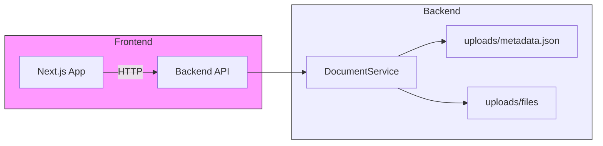

# insurance-chatbot

Executive summary

insurance-chatbot is a small multi-component project that provides a document-management backend API (FastAPI) and a Next.js frontend used to interact with the backend. The project is designed as a foundation for building an insurance-focused chatbot that can ingest and index policy documents for question answering.

## Architecture overview

- System Architecture: The repository is split into two primary components: `backend/` (FastAPI service for document uploads and listing) and `frontend/` (Next.js application to interact with the API).
- Technology Stack:
  - Backend: Python 3.14+, FastAPI, Pydantic v2, Uvicorn
  - Frontend: Next.js (React + TypeScript)
  - Storage: Local filesystem (uploads/)
- Component Interaction: Frontend calls backend REST endpoints under `/api/*`. Backend stores uploaded files in `backend/uploads/` and maintains a `metadata.json` manifest.

## Project structure

```
README.md                # Top-level documentation (this file)
backend/                 # FastAPI backend service
	README.md
	main.py                # FastAPI app and health endpoint
	api/                   # API routers
	models/                # Pydantic models and schemas
	services/              # Business logic (document service)
	uploads/               # Persisted uploaded files and metadata.json
frontend/                # Next.js frontend
	README.md
	src/                   # Application source
```

## Mermaid architecture diagram



## Getting started (quick)

Prerequisites: Python 3.14+, Node.js 18+ and a package manager (npm / pnpm / yarn).

Backend (from `backend/`):

```powershell
# create virtual env (optional) and install
python -m venv .venv; .\.venv\Scripts\Activate.ps1; pip install -r requirements.txt
# or use `pip install -e .` with pyproject.toml
uvicorn main:app --reload --port 8000
```

Frontend (from `frontend/`):

```powershell
npm install
npm run dev
```

## Change History

### 2025-10-18 - v0.1.0 - FEATURE

**Components Affected**: root, backend, frontend
**Summary**: Expanded README files with architecture overview, setup instructions, and change history. Added mermaid diagrams to each README for clarity.

---

## Contributing

Please open issues or pull requests. Follow the repository conventions and update the Change History section for any meaningful changes.
